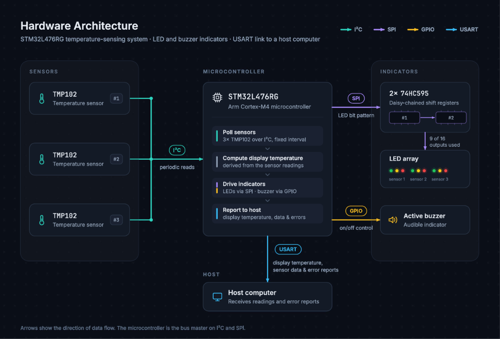

# Redundant Temperature Sensor System

A fault-tolerant temperature monitoring system built around an STM32-L476RG microcontroller and three redundant TMP102 temperature sensors.

The system periodically reads the sensors, evaluates the measurements for communication failures, out-of-range values, and disagreement between redundant measurements, and determines a final temperature value from the available valid readings.

Sensor status is communicated through LEDs and an active buzzer, while timestamped temperature and fault information is transmitted to a host computer over USART.

---

## Overview

This project includes code for **a redundant temperature sensor system** to be run on an STM32-L476RG microcontroller.

This system:

- Periodically samples multiple temperature sensors over a shared I²C bus, utilizing a timer interrupt,
- Detects sensor communication failures.
- Detects temperature measurements outside the sensor's specified operating range.
- Identifies measurements that deviate significantly from the other measurements received.
- Uses the results from the above analyses to determine a final display temperature.
- Drives status LEDs through a pair of 74HC595 shift registers.
- Activates an audible buzzer when sensor measurements are first flagged or go missing.
- Maintains a real-time clock (RTC) for timestamping measurements and errors.
- Communicates timestamped measurements and fault information to a host computer over USART.

The project is intended as a demonstration of embedded C programming, peripheral communication, and redundant-sensor decision logic.

---

## Topics/Technologies Involved

- Embedded C
- STM32L4 microcontrollers
- STM32 HAL
- TMP102 temperature sensors
- I²C communication
- SPI communication
- USART communication
- RTC timestamping
- Timer interrupts
- USART receive interrupts
- Fault detection
- Redundant sensor processing
- CMake
- Ninja
- ARM GNU Toolchain
- Visual Studio Code
- Cortex-Debug
- ST-LINK

---

## System Architecture

> **NOTE:** While the firmware logic that analyzes the temperature readings is designed to accommodate a variable number of temperature sensors, the default settings and code of the software overall expect 3 temperature sensors. This setup is used in the diagrams and explanations that follow.
> The astute engineer can discern how to modify the hardware (and what software constants and lines of code may need to be changed) to use the software with other numbers of sensors.

The firmware is intended to run on an STM32-L476RG microcontroller. TMP102 digital temperature sensors are connected to the microcontroller via a shared I2C bus, and are polled at fixed intervals.

The received sensor readings are then analyzed by the firmware, and a final 'display temperature' is determined. Based on both the readings from the sensors and the results of the determination logic running on the microcontroller, LED indicators associated with each sensor are then updated, and data is sent to a host computer via a USART connection.

The following diagram visualizes connections between different physical components of the system.



---

## Hardware

### Main Components

- STM32 Nucleo-L476RG
- 3 × TMP102 temperature sensors
- 74HC595 shift register(s)
- Active buzzer
- Red, yellow, and green LEDs
- 220 Ω resistors
- USB / micro-USB connection to host computer

### Sensor Configuration

The default firmware configuration expects three TMP102 sensors using the following I²C addresses:

| Sensor   | TMP102 Address |
| -------- | -------------: |
| Sensor 1 |         `0x48` |
| Sensor 2 |         `0x49` |
| Sensor 3 |         `0x4A` |

The sensors share the same I²C bus.

The firmware's redundancy logic is designed to work with a sensor array, although the overall application and hardware configuration currently expect three sensors.

### Status LEDs

Each sensor has a red, yellow, and green status LED.

The current implementation uses the LEDs to indicate the sensor's state:

| Sensor condition                        | LED indication |
| --------------------------------------- | -------------- |
| Valid reading                           | Green          |
| Invalid / flagged reading               | Yellow         |
| Communication failure / missing reading | Red            |

The LEDs are controlled through a 74HC595 shift register using SPI.

### Buzzer

An active buzzer is used to provide an audible indication when sensor conditions change.

A short beep is generated when a sensor becomes newly faulty. If all sensors become unavailable, the buzzer enters a continuous/extended alert state.

---

## Software Architecture

The firmware is divided into application modules under `Core/App/`, with the main.c file (initially generated by CubeMX, but edited by the author of this project) under `Core/Src/`, along with other STM generated or included .c files.

```text
Core/
├── App/
│   ├── alerts.c
│   ├── determination_logic.c
│   ├── hardware.c
│   ├── interrupts.c
│   ├── logging.c
│   ├── rtc.c
│   ├── sensor.c
│   └── usb_comm.c
│
├── Inc/
│   ├── alerts.h
│   ├── defines.h
│   ├── determination_logic.h
│   ├── error_codes.h
│   ├── faults.h
│   ├── hardware.h
│   ├── interrupts.h
│   ├── logging.h
│   ├── rtc.h
│   ├── sensor.h
│   ├── usb_comm.h
│   └── STM32/CubeMX-generated / included header files
│
└── Src/
    ├── main.c
    └── STM32/CubeMX-generated source
```

### High-Level Data Flow

```text
       TMP102 Sensors
       Sensor 1  ─┐
       Sensor 2  ─┼── I²C ──► Sensor Readings
       Sensor 3  ─┘                │
                                   ▼
                           Fault Detection
                                   │
                                   ▼
                         Redundancy Logic
                                   │
                    ┌──────────────┼──────────────┐
                    ▼              ▼              ▼
              Display Temp       LEDs          Buzzer
                    │
                    ▼
             Timestamp + Data
                    │
                    ▼
              USART / USB
                    │
                    ▼
             Host Computer
```

### Main-Loop / Interrupt Architecture

The timer and USART peripherals use interrupts, but substantial processing is intentionally performed outside the interrupt service routines.

The general execution model is:

```text
Timer Interrupt
      │
      ▼
Set readNow flag
      │
      ▼
Main Loop
      │
      ├── Read sensors
      ├── Flag questionable / missing readings
      ├── Determine display temperature
      ├── Log data
      ├── Update LEDs / buzzer
      └── Prep for next sensor read
```

The main loop is also set to, on each iteration through the loop, check and handle flags set or errors logged during execution of interrupt code, as well as to check the state of the buzzer (a non-blocking way to turn off the buzzer after a certain amount of time has elapsed).

USART reception follows a similar pattern:

```text
USART Receive Interrupt
      │
      ▼
Receive bytes into buffer
      │
      ▼
Message terminator received
      │
      ▼
Set flags/errors based on message received
      │
      ▼
Main Loop
      │
      └── Check for and/or handle flags set or errors logged
```

This keeps relatively time-consuming operations such as sensor communication, logging, and received RTC data processing out of interrupt callbacks.

---

## Sensor Redundancy and Fault Detection

Each sensor is represented by a `Sensor` structure containing its I²C address, current temperature, fault flags, the previous reading's fault flags, and associated LED assignments.

The firmware evaluates sensor readings in several stages.

### 1. Communication Check

If an I²C transaction fails, the sensor is marked with a communication fault:

```text
COMM_FAULT
```

Its current temperature is treated as unavailable.

### 2. Outlier Detection

Existing sensor readings are compared against one another.

If a reading differs from the current average by at least the configured disagreement threshold, it is marked as an outlier:

```text
IS_OUTLIER
```

The average is then recalculated using the remaining valid readings.

This process continues until the remaining readings no longer disagree beyond the configured threshold.

### 3. Temperature Bounds

After outlier processing, readings are checked against the configured upper and lower temperature bounds (by default set to the manufacturer's specified operating range for the sensors).

Measurements outside those limits are marked with:

```text
ABOVE_BOUNDS
```

and

```text
BELOW_BOUNDS
```

respectively.

### 4. Final Temperature

In light of the results of the aforementioned analyses, a final display temperature is determined.

Depending on the available sensor readings, the firmware may:

- Average multiple valid sensors
- Use the only remaining valid sensor (if only one sensor reading remains valid)
- Choose a reading from one sensor to display (when all readings disagree)
- Average multiple potentially invalid readings to display (when all readings have been marked as potentially invalid or questionable)
- Return `NAN` when no sensor readings are available

The exact determination logic is implemented in `determination_logic.c`.

---

## Fault Flags

Sensor faults are represented as a bitmask, allowing multiple fault conditions to be associated with the same sensor.

| Flag           | Meaning                                                           |
| -------------- | ----------------------------------------------------------------- |
| `COMM_FAULT`   | Communication with the sensor failed                              |
| `ABOVE_BOUNDS` | Temperature reading exceeded the configured upper bound           |
| `BELOW_BOUNDS` | Temperature reading below the configured lower bound              |
| `IS_OUTLIER`   | Reading was rejected because it disagreed with the other readings |

Because these are bit flags, multiple faults can be simultaneously associated with one sensor (e.g. a reading can be both above bounds and an outlier).

---

## Communication Protocol

The program is set to communicate with a host computer via USART (USB) using a baud rate of 115200. The STM32's USART connection is exposed to the host computer through the Nucleo board's USB connection.

Messages can be sent either to or from the microcontroller, although the only task intended to be done through sending data to the microcontroller is setting the RTC (see later in this section).

### Communication From the Microcontroller

Messages sent from the microcontroller to a host computer via USART use the following general structure:

```text
<header><message body>\r\n
```

The **header** consists of a letter identifying the type of message being transmitted, a colon, and a space. There are two different headers corresponding to the different message types:

- Data (`D: `)
- Error (`E: `)

#### Data Messages

Data messages begin with:

```text
D:
```

The message contains:

```text
D: timestamp, display temperature, sensor 1 temperature, sensor 2 temperature, sensor 3 temperature, sensor 1 faults, sensor 2 faults, sensor 3 faults
```

Example:

```text
D: 09/10/2026 10:42:18, 24.75, 24.75, 24.69, 24.81, , ,
```

A missing temperature is represented by:

```text
--.--
```

A description of the different pieces of information follows:

- Timestamp - The timestamp for the specific batch of data
- Display Temperature - The temperature returned by the microcontroller logic after analyzing the individual temperature sensor read values
- Sensor Values - The temperature values (in degrees Celsius) derived from the readings of each temperature sensor, separated by commas. (If a reading was missing, the value is transmitted as "--.--")
- Sensor Faults - A string of symbols representing different 'faults' associated with each temperature sensor reading.

#### Fault Symbols

Sensor fault strings use the following symbols:

| Symbol  | Meaning                               |
| ------- | ------------------------------------- |
| `` ` `` | Communication / missing-reading fault |
| `*`     | Outlier                               |
| `-`     | Below configured temperature range    |
| `+`     | Above configured temperature range    |

Multiple symbols can appear together when a sensor has multiple fault flags. Or, a string of fault flags can be simply an empty string if no flags have been marked for that sensor reading.

#### Error Messages

Error messages begin with the error message header:

```text
E:
```

and include a timestamp followed by the error code (a unique three digit number enclosed in square brackets []) and a message describing the error or situation that occurred that led to the sending of the message. Some examples include:

```text
E: 09/10/2026 10:42:18 [201] Sensor 1 Reading Missing.
```

```text
E: 09/10/2026 10:42:20 [303] Sensor 2 reading marked invalid as an outlier.
```

```text
E: 09/10/2026 10:42:22 [200] All Sensor Readings Missing.
```

They are also terminated by carriage return and newline characters. A table of different errors and their error codes is shown below.

| Error Code |                           Error |
| ---------- | ------------------------------: |
| 100        |          `SENSORS_NOT_DETECTED` |
| 200        |      `ALL_SENSOR_READS_MISSING` |
| 201        |           `SENSOR_READ_MISSING` |
| 300        |      `ALL_READS_MARKED_INVALID` |
| 301        |             `READ_ABOVE_BOUNDS` |
| 302        |             `READ_BELOW_BOUNDS` |
| 303        |        `READ_MARKED_AS_OUTLIER` |
| 400        |               `NOT_ENOUGH_LEDS` |
| 500        | `UNRECOGNIZED_COMMAND_RECEIVED` |
| 501        |          `RTC_FORMATTING_ERROR` |
| 502        |    `RTC_INVALID_DATETIME_ERROR` |
| 503        |                 `RTC_SET_ERROR` |
| 504        |                `RX_BUFFER_FULL` |
| 505        |            `RX_BUFFER_OVERFLOW` |

### Communication to the Microcontroller

#### Receive Buffer Behavior

The firmware maintains a single pending received message. If a complete message has not yet been processed by the time another message is fully received, the additional message is discarded and an `RX_BUFFER_FULL` error is reported, along with a request for the message to be resent.

Messages exceeding the receive buffer size generate an `RX_BUFFER_OVERFLOW` error. Once the maximum amount of characters have been received (by default 99 characters, not including the terminating `\n`), the error is generated, the buffer is reset, and any remaining bytes are then processed as being part of a new message.

Messages are terminated by a LF (`\n`), which is not included in the count towards the 99 max character limit for messages. CR (`\r`) characters are ignored (and do not count towards the 99 max character limit for messages either), allowing either LF (`\n`) or CRLF (`\r\n`) line endings to terminate a message.

Messages that are not recognized as a valid command generate an `UNRECOGNIZED_COMMAND_RECEIVED` error, unless the system is in a state expecting to receive date/time data via USART, in which case other errors may be logged in the case of invalid or incorrectly formatted data.

The only current command the firmware has been set up to recognize and handle via USART is setting the microcontroller's RTC, the process of which is explained below.

#### Initial Setting of the RTC Via USART Communication

The microcontroller will send a "`SEND_TIME\r\n`" message before entering normal operation. After this message is sent, the next received message is interpreted as the date/time value. The expected format is:

```text
YYYY/mm/dd HH:MM:SS
```

using 24-hour time.

Example:

```text
2026/09/10 10:45:30
```

This complete date and time data should be terminated by a carriage return and/or a newline character.

After receiving the date/time value, the firmware uses it to configure the STM32 RTC. If an error occurs during this process, the firmware reports an error and requests the time again. See the [RTC Errors](#rtc-errors) section below.

#### Resetting the RTC

The time may still be set after the first exchange of data if necessary.

If the microcontroller receives the command:

```text
SET_TIME\r\n
```

then the microcontroller will once again send a "`SEND_TIME\r\n`" message, and the next data received will be treated as the date, in the same format as described above. Once that date is received, that data will automatically be used to set the RTC. Again, if the supplied value is incorrectly formatted, the firmware will report an RTC formatting error and request the time again.

#### RTC Errors

The following are errors that may occur while setting the RTC:

| Error                        | Description                                                                        |
| ---------------------------- | ---------------------------------------------------------------------------------- |
| `RTC_FORMATTING_ERROR`       | Expected data to set the RTC, but received data was incorrectly formatted to do so |
| `RTC_INVALID_DATETIME_ERROR` | An invalid date was received as input to set the RTC                               |
| `RTC_SET_ERROR`              | An error occurred while attempting to set the parsed RTC time or date              |

---

## Build Instructions

### Prerequisites

The following software must be installed:

- Visual Studio Code
- CMake
- Ninja
- ARM GNU Toolchain (`arm-none-eabi-gcc`)
- Git

The **ARM GNU Toolchain must be available on the system `PATH`**, as the project's CMake toolchain file expects to locate the ARM compiler using the `arm-none-eabi-` command prefix.

CMake and Ninja must also be accessible to the CMake/VS Code build environment.

You can verify the required command-line tools with:

```bash
cmake --version
ninja --version
arm-none-eabi-gcc --version
git --version
```

### Clone the Repository

Clone the repository and navigate to the project directory:

```bash
git clone https://github.com/CodeyBrody/RedundantTempSensor.git
cd RedundantTempSensor
```

### Build with VS Code

The project uses the **CMake Tools** VSCode Extension with separate Debug and Release presets.

1. Open the project directory in Visual Studio Code.
2. Open the Command Palette with `Ctrl + Shift + P`.
3. Select **CMake: Select Configure Preset** and choose either `Debug` or `Release`.
4. Run **CMake: Configure**.
5. Run **CMake: Build**.

### Build from the Command Line

The project provides CMake presets for both Debug and Release builds.

#### Debug

```bash
cmake --preset Debug
cmake --build --preset Debug
```

#### Release

```bash
cmake --preset Release
cmake --build --preset Release
```

The CMake presets automatically configure the project to use the Ninja build system and the ARM GNU toolchain.

### Build Output

Both Debug and Release builds produce an **ELF executable**.

The Debug build includes debugging information and is configured for development and debugging. The Release build is optimized for size and does not include debugging information.

Generated build files are stored under:

```text
build/
├── Debug/
└── Release/
```

The generated build directory is excluded from version control.

## Flashing and Debugging

The project uses the **ST-LINK** programmer/debugger integrated into the **STM32 Nucleo-L476RG** board and the **Cortex-Debug** VS Code extension.

### Prerequisites

- Connect the Nucleo-L476RG to the computer via USB.
- Install the **Cortex-Debug** VS Code extension.
- Build either the **Debug** or **Release** configuration.

### Debug Build

1. Open the **Run and Debug** view in Visual Studio Code.
2. Select **Debug RedundantTempSensor**.
3. Press **F5** or select **Start Debugging**.

Cortex-Debug will program the Debug ELF through ST-LINK and start a debugging session.

### Release Build

1. Build the **Release** configuration.
2. Open the **Run and Debug** view.
3. Select **Release RedundantTempSensor**.
4. Press **F5** or select **Start Debugging**.

Cortex-Debug will program the Release ELF through ST-LINK and start the firmware.

```text
build/Release/RedundantTempSensor.elf
```

> **Note:** The Release build is optimized for size and does not include debugging information, so source-level debugging is limited compared with the Debug build.

## Project Configuration

Several application-level constants are defined in:

```text
Core/Inc/defines.h
```

For example:

```c
#define REQUESTED_SENSOR_SAMPLING_INTERVAL_SEC 2
#define DISAGREE_THRESHOLD 2.0
#define BUFFER_SIZE 100
```

`REQUESTED_SENSOR_SAMPLING_INTERVAL_SEC` controls the desired interval between sensor-reading cycles.

The default application configuration expects:

```text
3 sensors
```

and three sets of RGB status LEDs.

---

## Known Limitations

### Fixed Hardware Configuration

Although portions of the sensor-processing logic operate on a sensor array, the current overall code is configured specifically for three TMP102 sensors.

Changing the number of sensors may require corresponding changes to the hardware and code.

### Host Computer Software

This software is meant to work in tandem with a logging/display software on the host computer connected via USART to the microcontroller. While messages sent via USART can be viewed in a general serial monitor, this program relies on interacting with a software on the host computer (or receiving formatted data sent by a human) to configure the RTC.

To view one such program, feel free to check out the repository [here](https://github.com/CodeyBrody/TMP102RTSProjectLDSoftware.git).

If you would like to create your own, feel free to take a look at the [Communication Protocol](#communication-protocol) section above to see how data communicated over USART is structured.

### Timing

Sensor sampling is initiated by a timer interrupt and processed by the main loop. The configured interval represents the desired interval between reading cycles rather than a guarantee that every cycle will begin at an exact wall-clock time.

### Validation and Testing

While this project has been intended for learning and demonstration of abilities, significant testing should be undergone to ascertain whether this software is fit for any particular purpose before using it. Permission is also not necessarily given for use of the firmware either (see the [License](#license) section below for more information).

Currently no warranties are given for fitness for any particular purpose, and the code is not automatically approved for any use by anyone. Contact [@CodeyBrody](https://github.com/CodeyBrody) with questions.

---

## Future Improvements

Potential future development opportunities include:

- Documented unit and system tests
- Making it easier/more straightforward to change the code to use other than three sensors.
- Additional USART commands.
- Factor additional clues of suspicious readings (e.g. a huge rate of change) into determination logic.

---

## License

This repository contains original application code as well as software components generated or provided by STMicroelectronics and other third parties.

Original code is provided by the author. Vendor-provided and third-party components retain their respective copyrights and license terms.

See the applicable license files and copyright notices included with those components.

At this time, no single license is intended to supersede the individual licenses applicable to vendor-provided or third-party components.

> NOTE: Parts of this README.md file were created using ChatGPT, mixed with content from and edited by @CodeyBrody. Parts of this README.md may be incorrect or incomplete, or may become outdated. If you discover any such issues, feel free to open a pull request, or contact the owner of this repository. (Who, although this is written in the third person, did indeed write this himself.)
